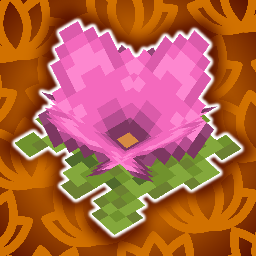

# Hi there! Thank you for checking out Florum Sporum!

Florum Sporum is a client and server-side [Fabric](https://fabricmc.net) mod that attempts to breathe more life into spore blossoms, without undoing any of Mojang's work!

Read on to find out how to download this mod, and what opportunities doing so will provide you with!

## Getting Started
Simply head to the releases page, find the latest release for the version you're playing on, and place the jar in your mods folder. This mod doesn't require any accompanying library.

## Details
Spore Blossoms can be found hanging on the mossy ceilings of lush caves, passively enriching the environment by producing a high concentration of spores. 
